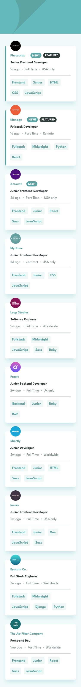

# Job listings With Filtering

This is a job listings website built using Next.JS and Typescript to filter out jobs based on selected categories. [Check It Out Here](https://job-listings-46zepx051-earthtobishop.vercel.app/).

## Table of contents

- [Overview](#overview)
  - [Features](#features)
  - [Screenshot](#screenshot)
  - [Links](#links)
  - [Built with](#built-with)
- [Author](#author)

## Overview

### Features

Users are be able to:

- View the optimal layout for the site depending on their device's screen size
- See hover states for all interactive elements on the page
- Filter job listings based on the categories

### Screenshot

### Links

- Solution URL: (https://github.com/earthtobishop/job-listings)
- Live Site URL: (https://job-listings-46zepx051-earthtobishop.vercel.app/)

### Built with

- [React](https://reactjs.org/) - JS library
- [Next.js](https://nextjs.org/) - React framework
- [TypeScript](https://www.typescriptlang.org/)
- Flexbox
- Mobile-first workflow

## Author

- Website - [Steven Bishop](https://www.earthtobishop.com)
- Frontend Mentor - [@earthtobishop](https://www.frontendmentor.io/profile/earthtobishop)
